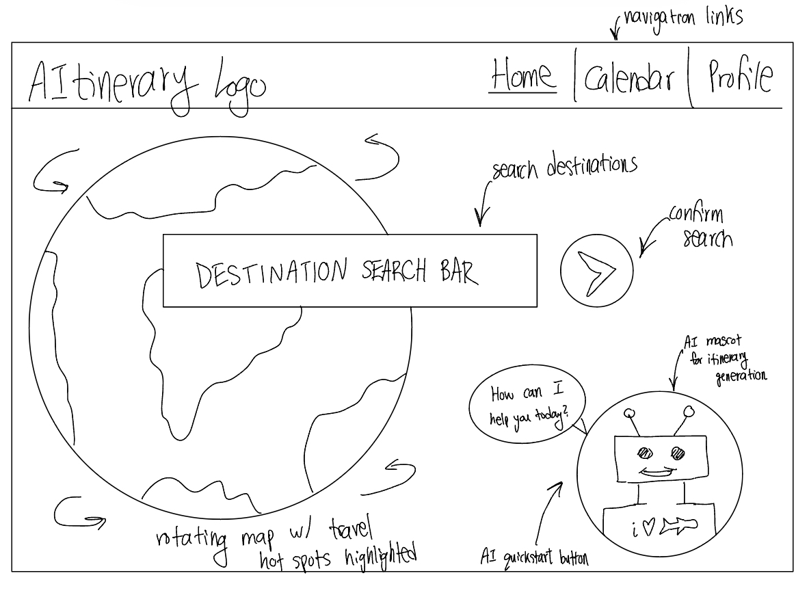
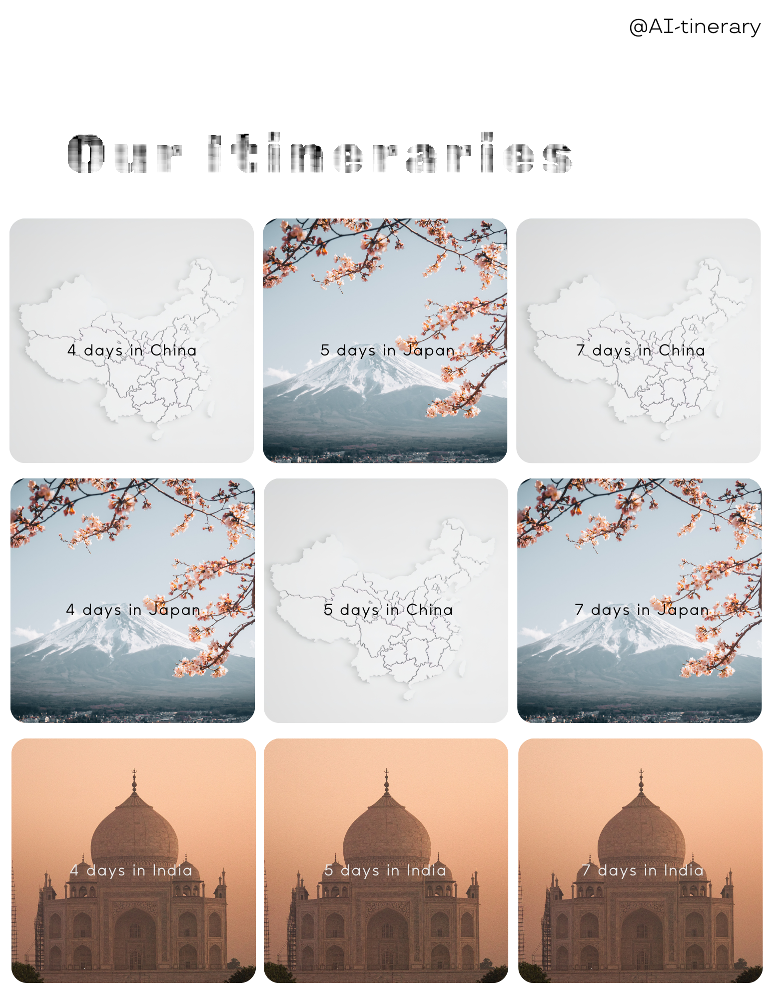
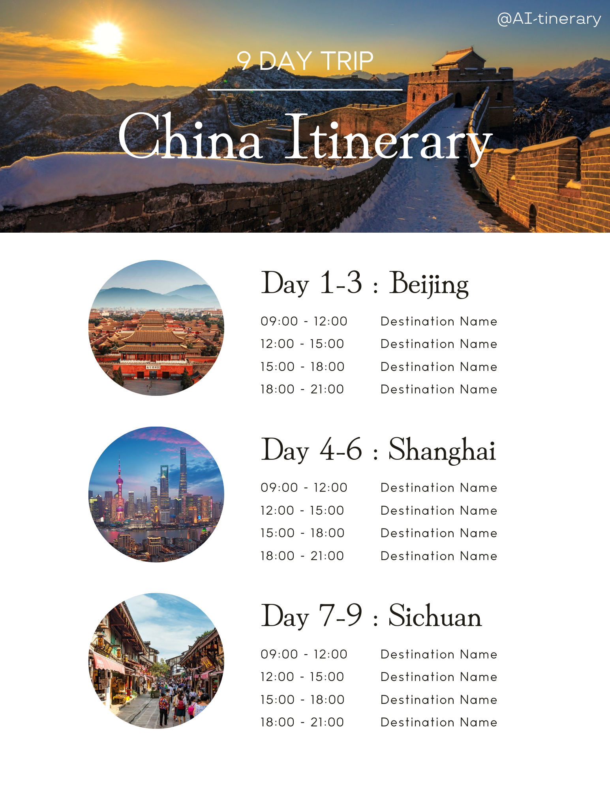

# Group 22 - AI-tinerary

### Deploy Status: 

## Elevator Pitch

Our app is the ultimate travel companion for everyone, from novice explorers to seasoned globetrotters. With our robust UI, you can seamlessly browse destinations and let our AI-powered system craft personalized itineraries based on your preferences. Perfect for all ages, our app ensures unforgettable journeys for students, parents, and families.

## Project Task Requirements:

### Minimal requirements

1. Account creation/authentication
   - [x] Find a suitable API for authentication
   - [x] Create a login / sign-up page and associated styling elements
   - [x] Ensure users stay signed in on page refresh (JWT)
2. Collect data on users via surveys
   - [x] Draft format of surveys
     - [x] Hot versus cold destinations
     - [x] Travel distance preferences
   - [x] Create a popup window to prompt users to take the survey
     - [x] Create associated UI components
   - [x] Initialize a database to store associated user data
     - [x] Populate user data from a survey for future itinerary creation
3. [x] Allow users to browse different travel destinations
4. [x] Allow for manual itinerary creation

### Standard requirements

1. [x] Use AI to create itineraries
2. [x] Include calendar functionality to track upcoming travel
   - [x] Have the itinerary sync to Google Calendar / Outlook
3. [x] View previously visited destinations and itineraries in a gallery
4. [x] Be able to view different locations on the homepage
5. [x] Interactive map view
   - [x] Be able to drop pins and see pictures of destinations
   - [ ] ~~Include danger warnings for different destinations~~ (not possible as this data is highly subjective and not published)
     - [ ] ~~Political unrest markers~~
     - [ ] ~~Weather concern markers~~
   - [ ] ~~Be able to see recently popular travel destinations~~

### Stretch requirements

1. [x] Auto-generate a PDF summary of a user's itinerary
2. [x] Make the site mobile friendly
3. [ ] Create itineraries on how to get to the destination
   - [ ] Include information on flights and hotels
   - [ ] Incorporate a user's budget into this
4. [ ] Create a family and friends list
   - [ ] Allow for group-based itineraries and linking with other accounts
5. [ ] Collect user data based on search history and website traffic

## Technology Usage

### Unit 1: HTML/CSS/JS
We have built our front end using React with the Material UI component library. MUI styling is strongly built around CSS properties and therefore a strong knowledge of CSS is required to successfully apply styling to MUI components. Overall, all of these JS technologies are built using HTML and CSS, making our knowledge of these technologies essential to building our application.

### Unit 2: React/Redux
We have built our front end using React and Redux. Our usage of these technologies includes best practices, as we have separated most of our visual elements into separate components, and passed down props as needed. Along with this, our usage of Redux is essential to maintaining the overall state of our application, including the usage of async thunks to retrieve data from our backend.

### Unit 3: Node/Express
We have built our backend using Node and Express. The best practices we utilized in our application include the proper handling of errors in every endpoint, ensuring that the server returns an appropriate success or error code and message with every endpoint. Along with this, we ensured that our API is RESTful, using the correct operation type when performing a data operation. Lastly, we have also protected all of our endpoints using authorization tokens, which are provided by the front end when the user is logged in.

### Unit 4: MongoDB
We have used a MongoDB Atlas Cluster to store our data. To connect our backend with our database and maintain best practices usage, we implemented Mongoose and created models for each of our data types. This includes Users, Itineraries, and Days.

### Unit 5: CI/CD
We practiced continuous deployment with our project by deploying our project after every merge to the main branch. We used GitHub Actions to trigger a deployment on Render and tracked the development using the Render API service. This enabled us to monitor successful and failed deploys using Github, allowing all members of our team to receive notifications for failed deployments.

## Above and Beyond Functionality

Our application goes above and beyond in several manners. Firstly, our app is completely responsive and mobile-friendly. This came with some challenges, as we have some complex pages where external components such as maps are used. To make these pages responsive, we had to create new components which are rendered only on the mobile site, which allows the user to switch between one of several views.

Next, our application involves the usage of technologies such as AI, which go beyond the scope of this course. This technology is used in our application to process the user preference data and generate new itinerary data for them.

Next, our site makes use of several external APIs, the most prevalent of which is the Google Maps API. Our usage of this technology is widespread in our application, from using the API to retrieve coordinates for locations, the usage of their Map components on our itinerary details page, to the use of their custom search APIs to retrieve relevant images for users to have better experience while viewing a list of their itineraries.

Lastly, we went above and beyond with our application by allowing users to export their itinerary data into several different formats. Allowing users to export their itineraries into their calendar or a PDF file is an essential service that allows the user to take their itineraries off of our platform and use them in their real life while travelling. Working with these technologies was especially difficult, as the calendar and PDF formats are notoriously difficult to work with, but considering that they are very widely used formats for scheduling and physical documents, we decided to implement this functionality.

## Next Steps
The next steps for our application involve the social, sharing, and collaboration aspects of the application. We would like to implement a sharing system, which would allow users to collaboratively view/edit their shared itineraries. Another sharing feature we would be looking to implement is the creation of shared itineraries, which involves an itinerary being created using the combined preferences of multiple users rather than only accounting for the preferences of one user. 

## Team Members/Contributions

- Nand Patel: Hello, I am a fourth-year computer science and mathematics student and I love taking photos with my film camera :-D
   - Infrastructure development
     - I worked on setting up our MongoDB atlas instance, allowing everyone to have access to read and write to the cluster.
     - I set up our Render deployments for both the front and back end, enabling continuous deployment using Github Actions.
   - Back-end development
     - I initially worked on setting up the Express boilerplate for our application, ensuring that everybody has a clean environment to begin implementing our server code.
     - I worked on integrating our application with the Google API, which enabled me to create the Google Maps Autocomplete Bar, the integration with our Map component, and several other features such as image retrieval with the Search API and coordinate retrieval using the Places API.
     -  I also worked on setting up the data model for itineraries, which enabled us to create the itinerary creation user flow.
     -  Furthermore, I worked on integrating the AI into our project by setting up the Replicate API and creating our first API call, which returned several details of essential itinerary information.
     -  I worked on integrating the AI into our project by setting up the Replicate API and creating our first API call, which returned several details of essential itinerary information.
     -  I also implemented an AI-integrated solution to generate a new day for an existing itinerary, which does not include any existing activities.
     -  I also worked on setting up the endpoints for retrieving, creating, editing, and deleting itineraries, which required working with the AI integration.
     - Lastly, I worked on securing our API endpoints, by utilizing the token generated for the user to validate their session and expecting that authorization token on the backend. This will prevent bad actors from freely accessing our backend while allowing authenticated users access to essential application processes.
   - Front-end development
      - I worked on maintaining styling consistency across our several pages, with consistent colours, borders, and sizes. I also worked on making the entire site responsive, which included adding new components and user flows for mobile site users.
      - Along with this, I worked on setting up form validation for all the forms on our website, ensuring that users are not able to perform any actions without entering the correct values for required fields.
      - I also implemented the drag and drop feature, which allows users to easily reorganize their itinerary, and/or activities within a specific day.
      - Later in the term, I worked on making our entire site responsive, which involved some page redesigns to allow the user to view all of the relevant information on a smaller screen.
   - Maintenance
      - Near the end of the term, I was responsible for keeping our codebase clean and organized, which I did by refactoring our components to have meaningful names and organizing them in specific directories. I also managed to add some comments to our code that will be helpful when trying to understand it.
   - Extra
      - I worked on the feature which allows the user to download a calendar invitation file, which creates several events (each tied to one activity in their itinerary) in the user's preferred calendar service.   
 
- Jiayin Kralik: I am a fourth year computer science student who is interested in systems! I'm building my own operating system this summer :)
   - Created detailed mockups of a user’s itinerary and the itinerary browsing page, providing a visual guide for further development.
   - Frontend: Tasked with and successfully created the itinerary card component, ensuring it integrates well with the rest of the application. Assisted in the initial stages of creating the day card component, laying the groundwork for its completion. Contributed to the initial development of the itinerary details page, ensuring it displays detailed information about each itinerary.
   - Activity Model Creation: Developed an initial version of the Activity model, nearly complete with only a few bugs left to fix. After discussion, the team decided to simplify by storing activities as an array inside the Day model.
   - Survey Component (for add itinerary): Designed and implemented the survey component for our project using Redux for state management. Focused on enhancing the visual presentation to ensure the survey component is user-friendly and visually appealing.
   - Home Page Enhancement: Worked on enhancing the home page to display itineraries, ensuring users can browse itineraries before signing up.
   - User-Specific Itineraries: Initiated the process of making itineraries user-specific, collaborating with Matthew who completed this task.

- Matthew Smith: I'm a BCS student, I have a background in Physics, and I'm passionate about SWE!
    - Frontend/UI:
         - I did significant work in prototyping and developing a proof-of-concept for our frontend UI in the early stages of the project
         - I created several key components including the navbar, the login form, and the signup form.
         - I created the theme and helped decide on the UI framework we used for the project.
         - I managed session state to persist authentication status on refresh (via JWT)
         - Ensured only a specific user's itineraries were shown upon sign-in.
    - Backend API:
        - I created any endpoints related to the authentication workflow. This includes sign up, login, and logout.
        - Developed utility functions needed for authenticating users and persisting that status.
        - I modified existing APIs to ensure itinieraries were unique to a specifix user
    - Data Model:
        - I created the User model which encapsulates all user data outside of itineraries
        - Integrated this model with relevant endpoints via Mongoose
    - Extras:
        - Developed extra functionality that allowed users to download their itinerary to a PDF. This included various UI changes, and additional API endpoint, and an elegant, custom-designed HTML template to create the PDF from. 
- Chris Tjondro: I like tennis. I like food. Lesson learned: Food after tennis -> Good, Food before tennis -> Bad.

## Extended Project Description

Our project is for travellers. From the absolute beginners to the travel connoisseurs, our app is for anyone with wanderlust! Of course, you can never be too young or old to travel, so our app is perfectly suited for students, adults, parents, and even whole families.

Our app will allow users to browse different travel destinations. By collecting user data through in-app activity as well as periodic surveys, our app will make travel itinerary and destination suggestions based on a user's preferences via the power of AI.

In order to support this, the app will store user data including region whitelists, blacklists, temperature and transportation method preferences, as well as personal user information including names and emails.

If time permits, some additional functionality that we can add is the ability to create travel itineraries for how to arrive at a destination, instead of just excursions while already there. Moreover, we can allow users to group their itineraries with other users if they are traveling together. On the other hand, if we are tight on time, we can remove the AI functionality altogether, and just have manual itinerary creation and destination tracking within our app.

## Images

- Matthew: Home page
  - 
- Jiayin: User-specific itineraries + browse itineraries
  - 
  - 
- Chris: Calendar View
  - 
- Nand: Map-view
  - 

## References
